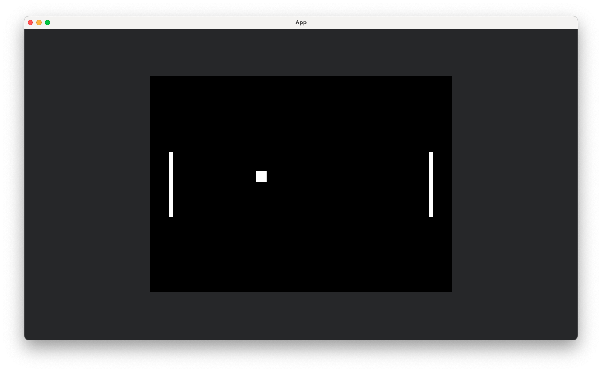

# Pongy

Just a Pong minimal clone to learn something about Rust, Bevy and ECS.

## Build

run `cargo build --release` and you will find the executable in `./target/release/pong`

## Run

run `cargo run --release` and you will see the game in action.

## Controls

- **Player 1**: `W` and `S` keys
- **Player 2**: `Up` and `Down` arrow keys

## License

This project is licensed under the MIT License - see the [LICENSE.md](LICENSE.md) file for details.

## Acknowledgments

- (Bevy)[https://bevyengine.org]
- (Pong)[https://en.wikipedia.org/wiki/Pong]
- (ECS)[https://en.wikipedia.org/wiki/Entity_component_system]

### Result

